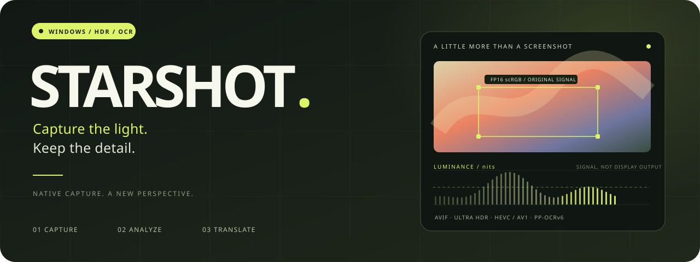
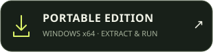
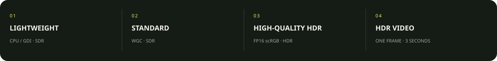

<div align="center">



<br><br>

**Keep the highlights. Give your words another life.**

Native Windows capture × HDR color × OCR & translation<br>
A screenshot tool. A small creative space on your desktop.

<p>
<a href="https://github.com/Yukikaze1945/Starshot/releases"></a>
<a href="https://github.com/Yukikaze1945/Starshot/releases"></a>
<a href="https://github.com/Yukikaze1945/Starshot/stargazers"></a>
<a href="LICENSE"></a>
</p>

<p>
<a href="https://github.com/Yukikaze1945/Starshot/releases/download/2.6.0-preview.8/Starshot-2.6.0-preview.8-setup-x64.exe"></a> &nbsp; <a href="https://github.com/Yukikaze1945/Starshot/releases/download/2.6.0-preview.8/Starshot-2.6.0-preview.8-win-x64.zip"></a>
</p>

<sub>Direct downloads: 2.6.0-preview.8 · Windows x64 · Installer / ZIP / SHA-256</sub>

<br><br>

[Download](#download) · [Capture modes](#capture-modes) · [Quick start](#quick-start) · [Development](#development)

[简体中文](README.md) · **English**

</div>

<br>

## A little more than a screenshot

Fire in a game. Neon in a film. A paragraph on your desktop. Save the image, and keep working with the information inside it.

Starshot pairs native C# capture with a React / WebView2 workspace.

| | |
| :--- | :--- |
| **01 / KEEP THE LIGHT** | **02 / FRAME THE MOMENT** |
| Original FP16 scRGB capture; HDR AVIF, JPEG XL, PNGv3 and Ultra HDR JPEG. StarshotPerceptual maps ordinary SDR exports, keeping HDR saving separate. | Window detection, pixel magnifier, compact grouped toolbar and contextual annotation controls. Shapes, arrows, brush, text, undo / redo, pinned images, scrolling capture and GIF recording. |
| **03 / WORK WITH WORDS** | **04 / INSPECT THE SIGNAL** |
| Bundled PP-OCRv6 Tiny, optional Small DLC. OCR opens a compact editor before copying. Connect an OpenAI-compatible API, discover models and translate with formatting structure. | Cursor, Min, Max, Average and P99. Expand a waveform or overlay a heatmap with adjustable opacity; the analysis overlay stays out of your saved image and clipboard. |

## Capture modes



| Mode | Capture & output | Use it for |
| :--- | :--- | :--- |
| **Lightweight** | CPU / GDI capture and selection; native SDR | Everyday desktop captures with fewer graphics resources |
| **Standard** | WGC capture; SDR output | General window and screen capture |
| **High-quality HDR** | FP16 scRGB on HDR displays; HDR images or mapped SDR | Games, films, highlights and wide-gamut content |
| **Single-frame HDR video** | HEVC / AV1 MP4; exactly one frame held for 3 seconds, no audio; companion image | Trying mobile HDR video decoding as a screenshot-sharing path |

Switch in screenshot settings or the tray context menu. SDR displays produce SDR content. Mobile playback support depends on the device and player.

<details open>
<summary><b>✦ Freeze the frame. Take your time.</b></summary>

Drag a region or click a window; select across monitors. Common actions stay within one click, with grouped annotation tools and contextual color / width settings. Copy, save or OCR is highlighted according to the capture entry point. Esc dismisses menus, editing and the session in layers.

Pinned images, vertical / horizontal scrolling capture and GIF recording continue from the selection. Screenshot library and clipboard pages support preview, copying, management and batch conversion.

</details>

<details>
<summary><b>✦ HDR images, SDR appearance & luminance analysis</b></summary>

Original floating-point data drives HDR export. **StarshotPerceptual** protects desktop brightness and compresses highlights for SDR images. **Ultra HDR JPEG** adds an SDR base with an HDR gain map; HDR Capacity Max is adjustable.

HDR analysis requires original HDR FP16 data. SDR / lightweight captures cannot masquerade as absolute nits. Signal luminance is estimated as `max(0, (0.2126R + 0.7152G + 0.0722B) × 80)`; it is not physical display emission. Analysis is prepared on demand, and large-region sampling is marked approximate.

[Capture modes](docs/capture-modes.md) · [Analyzer lifecycle validation](docs/reports/hdr-analysis-lifecycle-20261009/REPORT.md)

</details>

<details>
<summary><b>✦ Local OCR. Translation when you ask for it.</b></summary>

**Tiny is bundled and selected by default.** Optional Small DLC supports download, verification, cancellation, selection and deletion. Models load on first use; Tiny and Small are not both kept loaded. Missing or damaged Small falls back to Tiny.

OCR opens a separate editor with paragraph / original-line formatting. Auto-copy is optional and defaults off. The text workspace also accepts typed text and supports selection formatting.

Configure API endpoint, key and model; discover models automatically. Keys are stored using Windows DPAPI. **OCR runs locally.** Translation sends text to your configured API and may incur provider charges.

[OCR model deployment & notices](third_party/simdpaddleocr/README.md)

</details>

## Download

| Package | Get it | Details |
| :--- | :--- | :--- |
| **Offline installer** | [Download EXE ↗](https://github.com/Yukikaze1945/Starshot/releases/download/2.6.0-preview.8/Starshot-2.6.0-preview.8-setup-x64.exe) | About **322 MiB**; WebView2 Runtime included; upgrades preserve configuration |
| **Portable** | [Download ZIP ↗](https://github.com/Yukikaze1945/Starshot/releases/download/2.6.0-preview.8/Starshot-2.6.0-preview.8-win-x64.zip) | About **165 MiB**; extract and run root `Starshot.exe`; WebView2 Runtime required |
| **Checksums** | [SHA256SUMS.txt ↗](https://github.com/Yukikaze1945/Starshot/releases/download/2.6.0-preview.8/SHA256SUMS.txt) | Installer / ZIP SHA-256 |
| **All versions** | [GitHub Releases ↗](https://github.com/Yukikaze1945/Starshot/releases) | Release notes, earlier versions and future updates |

> [!IMPORTANT]
> Public packages are **Windows x64 previews**. Windows 11 is recommended. HDR capture needs a display with Windows HDR enabled; SDR displays still support screenshots and OCR. Read release notes for limitations. Starshot product-signing certificates are not currently configured.

Installation directory: `%LOCALAPPDATA%\Programs\Starshot Fork`. Updates query this repository's Releases and prompt before downloading. Enable preview updates to receive previews. Distribution uses full packages.

## Quick start

1. Choose a capture mode in settings or the tray menu.
2. Capture with a shortcut, then drag a region or click a window.
3. Annotate, copy, save, or edit recognized text in the OCR window.

| Action | Default shortcut |
| :--- | :--- |
| Full-screen | <kbd>Alt</kbd> + <kbd>W</kbd> |
| Region | <kbd>Alt</kbd> + <kbd>Q</kbd> |
| Region copy only | <kbd>Alt</kbd> + <kbd>A</kbd> |
| Region OCR | <kbd>Alt</kbd> + <kbd>O</kbd> |

Shortcuts support combinations or single keys. Custom settings override these defaults. Auto-copy is controlled separately.

<details>
<summary><b>Notes about downloads & HDR</b></summary>

The release badge updates automatically; direct buttons point to a verified version. Use “All versions” for newly published previews.

Analysis requires original HDR FP16 data, excluding mixed SDR regions. Additionally, `preview.8` has a display-enumeration eligibility bug. A fix exists; its installer has not yet been uploaded to Releases.

Phone OS, display headroom and application support affect HDR rendering. Ultra HDR JPEG and single-frame video offer different sharing paths without guaranteeing identical output on every device.

OCR runs locally. Model-powered translation is a separate action sending text to the configured API.

</details>

## Development

Native C# / .NET 10 · React 19 · TypeScript · Vite · WebView2. Native capture, HDR, hotkeys, tray, clipboard and OCR are retained; lightweight selection uses CPU / GDI.

<details>
<summary><b>Build from source · Windows x64</b></summary>

Install **.NET 10 SDK, Node.js 24, Visual Studio 2026 with C++ / .NET desktop workloads and Windows SDK 10.0.26100**.

```powershell
git clone https://github.com/Yukikaze1945/Starshot.git
cd Starshot
dotnet build src/Starshot/Starshot.csproj -c Debug -p:Platform=x64
```

The build prepares WebUI and fixed-version encoder components. Initial setup needs network access. Run the debug application at `build/app/Starshot.exe`.

Frontend-only preview:

```powershell
cd src/Starshot.WebUI
npm ci
npm run dev
```

Browser preview lacks the desktop bridge. Packaging also needs the native launcher, Inno Setup and Microsoft-signed offline WebView2 installer. See [release instructions](docs/releasing-fork.md).

</details>

[Report a bug](https://github.com/Yukikaze1945/Starshot/issues/new) · [Browse commits](https://github.com/Yukikaze1945/Starshot/commits/fix/uhdr-wide-gamut-red) · [Contribute](https://github.com/Yukikaze1945/Starshot/pulls)

## Credits & licenses

Based on [loliri / Starshot](https://github.com/loliri/Starshot), retaining author and contributor notices. Source is licensed under [MIT](LICENSE). Third-party components retain their own licenses: [SimdPaddleOCR notices](third_party/simdpaddleocr/README.md) and the separate [GPL v3 FFmpeg build](third_party/ffmpeg/7.1.1/win-x64/README.txt). Releases include applicable notices and source references.

<br>

<div align="center">

**CAPTURE THE LIGHT. KEEP THE DETAIL.**

<sub>Starshot Fork · Source, downloads and updates. One repository.</sub>

<br><br>

[](https://github.com/Yukikaze1945/Starshot/stargazers)

</div>
