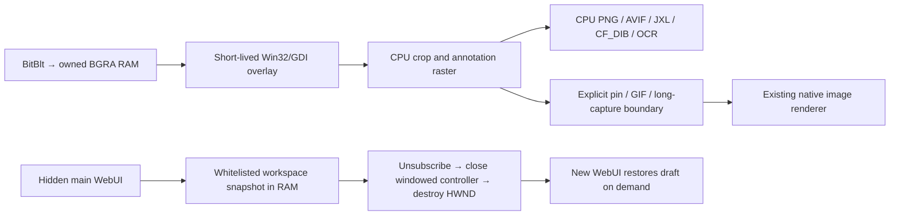

# ADR-0001: CPU selection and windowed WebView2 retirement in lightweight mode

## Status

Accepted for the lightweight implementation, 2026-10-08. The user authorized
implementing the audit recommendations with PixPin's approximately 118 MB
dedicated resident and committed counters as the target. Validation scope is
offscreen; the user requested no desktop mouse/keyboard testing.

## Context

The first lightweight backend captured BGRA pixels through GDI but uploaded the
full frozen desktop to the existing WinUI/Win2D region window. A 3840×2160 BGRA
surface carries 31.64 MiB before compositor/driver overhead. Full-desktop textures,
selection swapchains, annotation targets and cached hidden GUI resources defeat a
120 MiB process budget. WGC contexts were already being retired on mode changes;
normal teardown logs did not prove a remaining WGC leak.

CPU selection alone was insufficient. One subsequent 20-cycle run retained
211.22 MiB in the root process after the main HWND was destroyed, the managed
window was reclaimed and every WebView2 child had exited. Other fresh runs were
approximately 88 MiB, so those lower values were not a reliable acceptance result.
This motivates removing the main window's XAML/composition scene. It does not
prove which driver or compositor allocation produced the residue.

Both dedicated resident and committed memory must be measured. Evicting a
resource without releasing its commitment does not meet the requirement. The
standard/HDR long-lived WGC architecture and HDR/P3/UHDR mathematics must remain
unchanged. Existing OCR, annotation, copy/save and image tools must still work.

## Decision

Ordinary lightweight capture uses owned, tightly packed CPU pixel buffers and
GDI DIBs. Native window callbacks are rooted only while their HWND is live.
One-shot move-in remains independent from redraw; selection and annotations use
event-driven paint. Frame/crop handoff has one owner, including rejected results
and exceptional paths. Notifications are CPU-rendered, bounded and short-lived.

WGC retirement fences new captures and attempts all cleanup stages. A failure
prevents committing the mode switch. The old GPU region/info windows are closed;
already-used shared device caches can be trimmed without disposing their device.

The main and compact OCR GUI host the existing React assets directly inside a
native HWND using a windowed CoreWebView2Controller. Bounds use client-area raw
pixels with monitor-scale detection. Resize, DPI, focus, native title bar, themes,
trusted-origin RPC and error retry are retained. No full-window main XAML scene is
created; legacy utility dialogs can still own their own transient XAML hosts.

The hidden lightweight main GUI retires only after RPCs, utility windows and
unsaved settings/translations permit it. Its versioned workspace snapshot is
limited to 4 MB, excludes credentials, and is never persisted. Closed windows
unsubscribe settings and mode events. Toast leases and WebView2 bridge handlers
also release their owners. Partial controller initialization is closed on failure;
window close still executes if earlier detach cleanup throws. HWND destruction
releases the static native callback registry; a failed destruction remains
retryable on the creating thread instead of being marked successfully disposed.

## Consequences

- Ordinary captures avoid full-desktop GPU upload and persistent capture surfaces.
- CPU buffers increase system-memory traffic and allocation pressure. In stress
  runs private memory can remain committed to the managed heap after pixel owners
  are disposed; this is measured separately from dedicated GPU memory.
- Lightweight is SDR and has GDI's desktop/protected-content limitations.
- Native CPU UI needs its own hit-testing/raster implementation; geometry,
  annotation composition and ownership tests cover these boundaries.
- Main-window reopening reloads local WebUI assets. Draft preservation avoids
  losing formatted text, but unsaved work can deliberately defer retirement.
- Pinning, recording, long capture and OCR editors remain explicit GPU/GUI tools;
  their active memory is not covered by an ordinary capture-only budget.
- DWM, WebView2 child processes and driver caches still consume memory. Process
  counters and child-process lifecycle must be reported without claiming zero GPU.

## Alternatives considered

- Keep the GPU region overlay and trim afterward: peak allocations still exceed
  the requested budget, and hidden windows keep rendering resources alive.
- Disable/recreate WGC globally: reintroduces the prior session-recreation growth
  and changes standard/HDR capture unnecessarily.
- Force collections, alter D3D devices or change HDR math: excluded by the user;
  no new forced collection or device strategy is introduced. The existing app
  collection timer is disabled only in the diagnostic process, not changed here.
- Disable Chromium GPU: a prior diagnostic gave no reduction in root-process
  counters. No such flag is shipped.
- Retain the main XAML WebView2 host with more event cleanup: the 211 MiB run still
  failed the budget after object/child-process teardown. The direct windowed host
  retains the same UI and RPC without a main XAML scene.
- Create a separate GUI process: adds IPC and deployment complexity; deferred
  unless the windowed host still fails the paired-memory budget.

## References

- [Audit](../reports/2026-10-03-lightweight-vram-audit.md)
- [Validation](../reports/2026-10-08-lightweight-cpu-validation.md)
- [Win2D CanvasDevice.Trim](https://microsoft.github.io/Win2D/WinUI3/html/M_Microsoft_Graphics_Canvas_CanvasDevice_Trim.htm)
- [Microsoft WinUI window event retention report](https://github.com/microsoft/microsoft-ui-xaml/issues/9960)
- [Windowed WebView2 controller](https://learn.microsoft.com/en-us/microsoft-edge/webview2/reference/winrt/microsoft_web_webview2_core/corewebview2controller)

The Microsoft issue explains why explicit event detachment is prudent; it is not
proof that every observed allocation in this project came from that issue.
