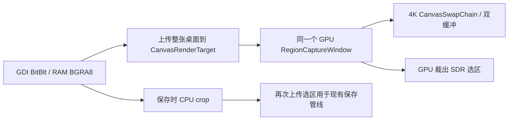

# Starshot 轻量模式显存审计

审计日期：2026-10-02～2026-10-03。对象：已安装的 `2.6.0-preview.4` 与对应本地源码。系统：Windows 11 专业版 Insider Preview，build 26220。目标：截图结束后的显存占用低于用户提出的 150 MB 上限，尽量低于 120 MB。

本轮只读取源码、安装文件、配置、现有日志和进程计数器；没有修改生产代码、安装目录或配置，没有启动应用、触发截图、操作桌面或运行压力测试。

## 结论与证据强度

| 问题 | 审计结论 | 证据 |
| --- | --- | --- |
| 轻量模式仍复用 GPU `RegionCaptureWindow`？ | **确认。** GDI 抓到 RAM 后，整张桌面仍上传为 GPU 位图，再进入同一个 WinUI/Win2D 双缓冲选区窗口。 | 源码与实际轻量截图日志一致。 |
| 切轻量后旧 WGC context 没有真正 teardown？ | **本次观察到的正常切换没有这个问题。** 旧 context 已完成 latest/session/pool/item 的清理，随后轻量截图没有创建 WGC context。 | 实际日志记录了 context disposed、释放数量 1、模式提交为 Lightweight，顺序正确。 |
| 截图结束后仍持有完整 swapchain / 整屏截图字段？ | 正常路径会解绑并 Dispose swapchain，清空覆盖层的整屏图像字段，服务 finally 也释放位图。**没有发现正常结束后由这些字段直接保活整屏截图。** | `CloseWindow`、`ReleaseSwapChain`、服务 finally。 |
| 为什么仍可能占用较多显存？ | 覆盖层 HWND 保持可见并移至屏外，WinUI 视觉树保留；共享图形设备保留；已经打开的主界面隐藏后 WebView2 继续存活。**各项剩余驻留量尚未分别测定。** | 对象生命周期已确认；显存归因属于待测假设。 |
| 120/150 MB 是否已达标？ | **尚未完成可靠验收。** 现有轻量模式没有针对这一预算设计；当前资料不能证明截图结束后整套应用稳定低于目标。 | 没有受控的结束后采样或进程组驻留量测量。 |

上一版只轻量化了采集后端，没有轻量化选区显示和输出链路。这是本次确认的主要设计缺口。此前功能测试通过，并不代表显存预算通过。

## 版本和实际运行证据

审计开始时运行的主进程为 PID 38076，路径：

`C:/Users/18392/AppData/Local/Programs/Starshot Fork/app-2.6.0-preview.4/Starshot.exe`

安装版与本地发布版的 `Starshot.dll` SHA-256 完全一致：

`F36B972957D92ADDA707F45FC4945E356C4740EF1C75CE2FF0730591517DACA8`

配置文件 `C:/Users/18392/AppData/Local/Programs/Starshot Fork/config.sjson` 中 `ScreenCaptureMode` 为 `0`，即 Lightweight。后续复核时 Starshot 已退出；没有为了补测而重启它。

[原始应用日志](C:/Users/18392/AppData/Local/Starshot/log/Starshot_2.6.0-preview.4_261002.log) 中有以下完整顺序，时间为 2026-10-02、本地时区：

| 时间 | 原日志行号 | 事件 |
| --- | ---: | --- |
| 22:43:34.591 | 13 | Lightweight GDI RAM snapshot，3840×2160，no WGC context |
| 22:43:42.179 | 100 | Region copy-only done |
| 22:45:27.878 | 106 | 切到 HDR 前释放旧 context：count=0 |
| 22:45:27.882 | 109 | 模式提交为 HighQualityHdr |
| 22:45:35.131 | 121 | 创建 3840×2160、FP16 WGC context |
| 22:45:37.508 | 190 | Region copy-only done |
| **22:45:53.000** | **196** | **WGC context disposed：monitor=65537** |
| **22:45:53.000** | **199** | **旧 context 已释放：count=1** |
| **22:45:53.003** | **202** | **模式提交为 Lightweight** |
| 22:45:55.807 | 211 | Lightweight GDI RAM snapshot，3840×2160，no WGC context |
| 22:45:57.842 | 271 | Region copy-only done |

这段日志没有 `Failed to dispose WGC context`、swapchain 解绑或释放失败的记录。它可以证明该次 WGC 清理路径执行完成，不能证明驱动立刻归还全部历史 GPU residency，也不能排除其他图形对象仍有引用。

## 轻量路径实际做了什么

- [ScreenCaptureService.cs:328](D:/coding/Starshot/src/Starshot/Features/Screenshot/ScreenCaptureService.cs:328)：轻量分支先读取 RAM，再立即调用 `GdiCaptureBackend.Upload` 上传完整虚拟桌面。
- [ScreenCaptureBackends.cs:40](D:/coding/Starshot/src/Starshot/Features/Screenshot/ScreenCaptureBackends.cs:40)：`Upload` 创建真实 `CanvasRenderTarget`，不是 CPU bitmap 包装。
- [ScreenCaptureService.cs:428](D:/coding/Starshot/src/Starshot/Features/Screenshot/ScreenCaptureService.cs:428)：三种模式共用 `_regionWindow`，没有独立的轻量覆盖层。
- [RegionCaptureWindow.xaml.cs:215](D:/coding/Starshot/src/Starshot/Features/Screenshot/RegionCaptureWindow.xaml.cs:215)：创建整屏 BGRA8、bufferCount=2 的 GPU swapchain。200% 缩放只改变 DIP 尺寸，物理缓冲仍为 3840×2160。
- [RegionCaptureWindow.xaml.cs:1427](D:/coding/Starshot/src/Starshot/Features/Screenshot/RegionCaptureWindow.xaml.cs:1427)：复制、保存、OCR 等完成动作先通过 GPU 裁出 SDR 图像。
- [ScreenCaptureService.cs:562](D:/coding/Starshot/src/Starshot/Features/Screenshot/ScreenCaptureService.cs:562)：轻量保存的 CPU crop 再上传一次。保存和剪贴板还分别使用保存图像与 SDR 图像。

SDR 的 `CreateDisplayBitmap` 直接返回原位图，并没有额外创建整屏 tone-map 图；因此这里没有把同一位图重复计入 GPU 预算。`GetPixelBytes()` 生成的是 RAM 数组，也不应当算成显存。

按未计对齐的像素载荷计算，单位为 MiB（1024² 字节）：

| 图像资源 | 3840×2160 BGRA8 载荷 |
| --- | ---: |
| 整屏 GPU 冻结位图 | 31.64 MiB |
| swapchain 两张缓冲 | 63.28 MiB |
| 选区显示期间以上三张合计 | **94.92 MiB** |
| 完成全屏选区时再创建 SDR crop | +31.64 MiB，约 **126.56 MiB** |
| 有标注时再创建独立全屏 annotation layer | +31.64 MiB，约 **158.20 MiB** |

这些只是相应阶段的像素载荷，尚未包括 WinUI、DirectComposition、设备、驱动对齐或 WebView2 的开销；也不保证全部同时物理驻留。**这些活跃峰值不能被当成截图结束后的常驻量。** 用户当前关心的“截图后”预算，需要另外测量。

## 结束后清理与剩余生命周期

### 已确认的正常清理

[RegionCaptureWindow.CloseWindow](D:/coding/Starshot/src/Starshot/Features/Screenshot/RegionCaptureWindow.xaml.cs:1262) 停止 one-shot timer、失效 generation、移出屏幕，并调用 [ReleaseSwapChain](D:/coding/Starshot/src/Starshot/Features/Screenshot/RegionCaptureWindow.xaml.cs:1321)：

`Canvas.SwapChain = null` → `old.Dispose()`。

随后 `_displayBitmap`、`_displayPixels`、`_canvasOriginal` 清空；独立显示图像由窗口释放，借用的 composite 由服务负责。服务 [finally](D:/coding/Starshot/src/Starshot/Features/Screenshot/ScreenCaptureService.cs:675) 释放 cropped、sdrCrop、annotationLayer、composite、desktopRam 和 operation lease。

GDI 的 DIB、DC、SelectObject 配对也都在 [finally](D:/coding/Starshot/src/Starshot/Features/Screenshot/GdiCaptureFrame.cs:50) 中。剪贴板接收 CF_DIB 字节数据，不会长期持有原来的 CanvasBitmap。

### 确实保留、但尚未量化的资源

| 资源 | 保留方式 | 能否解释剩余显存 |
| --- | --- | --- |
| 整屏覆盖层窗口 | `MoveOffscreen(-32000,-32000)`，`SWP_NOSIZE`；刻意不 Hide，不销毁 HWND。 | 是优先检查项；不能仅凭代码断言它继续占用原双缓冲。 |
| 覆盖层 WinUI/Composition 视觉树 | 正常截图结束不调用 `Canvas.RemoveFromVisualTree()`；只有真正 Window Closed 时才 [Cleanup](D:/coding/Starshot/src/Starshot/Features/Screenshot/RegionCaptureWindow.xaml.cs:1473)。 | 图形基础设施继续存活；具体 resident 大小未测。 |
| Shared CanvasDevice | 选区、信息窗和其他 native 工具共用，结束一次截图不会销毁整个共享设备。 | 设备及内部缓存可能保留；共享设备存活本身不是泄漏证据。 |
| 主界面 WebView2 | [MainWindow 关闭事件](D:/coding/Starshot/src/Starshot/Features/ViewHost/MainWindow.xaml.cs:47) 取消真正关闭并 Hide；只有真正 Closed 才 `WebHost.Close()`。没有隐藏后的 suspend/unload 路径。 | 是独立的应用显存来源；需要计入它自己的 GPU 辅助进程。 |
| 截图信息窗缩略图 | 隐藏后仍保留 `ThumbnailImage.Source` 和 `_imageSource`。200% 下图像为 144×144，约 0.079 MiB 像素载荷。 | 单张缩略图不足以解释数百 MiB；窗口和图形基础设施的开销需单独量化。 |
| 贴图、查看器、OCR 窗口 | 用户打开后有各自图像/窗口生命周期。 | 验收轻量空闲基线时应分别记录是否打开，不能把正常功能驻留误当截图泄漏。 |

主界面已有 `--hide` 启动时不创建 MainWindow 的路径；因此不能笼统认定每次托盘启动都必定加载 WebView2。问题是**主界面打开过后，普通关闭不会卸载它**。

## WGC teardown 核查

设置页和托盘均调用 [CaptureModeController.SetModeAsync](D:/coding/Starshot/src/Starshot/Features/Screenshot/CaptureModeController.cs:34)。生产代码中没有找到绕过它写入模式的其他入口。

切换顺序：拒绝进行中的 capture operation → 标记 switching → await [ReleaseContextsAsync](D:/coding/Starshot/src/Starshot/Features/Screenshot/MonitorCaptureContext.cs:186) → 清除 Cache 并退役 slot → 等待 slot gate → Dispose → 最后写入模式配置。

[context Dispose](D:/coding/Starshot/src/Starshot/Features/Screenshot/MonitorCaptureContext.cs:451) 会释放 latest copied bitmap、解绑 FrameArrived、关闭 session、关闭 framePool、释放 item 的 WinRT native reference。`WGC context disposed` 日志位于这些操作之后，本次确实出现。原始 `CreateForMonitor` / `CreateForWindow` ABI 指针的配对 `Marshal.Release` 也仍在代码中。

轻量 monitor 入口选择 GDI backend；区域截图直接走 GDI RAM 分支；未发现静默回退 WGC 的路径。保留的旧 `CaptureWindowAsync` 本身是 WGC，但在生产代码中仅找到定义，未找到调用点。纯轻量抓帧没有建立 WGC latest-frame cache。

因此本次不能把大占用解释为“设置 UI 切了轻量，实际还在维持旧 WGC session”。仍未确定的是 context 之外的图像、合成器和驱动资源如何释放或驻留。

## 额外发现的异常清理缺口

这些是代码风险，**现有成功截图日志没有证明它们被触发**，不应拿来替代主因判断：

1. **WGC latest.Dispose 抛异常会中断后续清理。** `_latest?.Dispose()` 位于 session/pool/item 的嵌套 finally 之前。`DisposeSlot` 吞下异常并把 context 置 null，之后仍可能打印 released count；所以单看 count 不足以证明清理全部成功。本次同时有 `context disposed`，故该次不属于这个失败路径。
2. **GPU crop 创建后绘制失败没有本地释放保护。** `CropDisplayToBgra()` 先 new renderTarget，再 CreateDrawingSession/DrawImage，缺少失败时 Dispose renderTarget 的 catch/finally。调用方尚未收到返回值，外层只能关闭窗口，不能立即释放这个局部 target。`SetCapture` 创建 swapchain 后的初始化异常，也没有统一回滚到关闭状态。
3. **信息窗 DPI 改变时旧 CanvasImageSource 被直接覆盖。** `CropImage` 在 targetSize 变化时没有显式 Dispose 旧对象；同 DPI 下会复用，单张很小。部分 HDR 显示/缩略图的局部 effect 也缺少显式释放，属于另行收紧 ownership 的项目；不应同时改变 HDR 算法。

这些补强值得做，但单独补几个 Dispose 不能把仍使用整屏 GPU UI 的轻量模式变成稳定低于 120 MB 的实现。

## 截图读数与计量口径

用户提供的进程列表没有表头。Starshot 行能读到 348.32 MB、124.48 MB、964 kB、335.03 MB、964 kB，但**不能从数字位置可靠判断每列语义**，也不能把第一项 CPU 内存或后一项提交量直接当成当前驻留显存。

查阅的 [SystemInformer 官方列定义](https://github.com/winsiderss/systeminformer/blob/master/plugins/ExtendedTools/treeext.c) 明确区分 `GPU dedicated bytes (resident)`、`GPU shared bytes (resident)`、`GPU dedicated bytes (committed)`、`GPU shared bytes (committed)`；[采样实现](https://github.com/winsiderss/systeminformer/blob/master/plugins/ExtendedTools/gpumon.c) 也分别读取 Usage 和 BytesCommitted。这是当前源码定义，不足以证明用户版本的实际列排列。

**如果原图恰好使用上述两组列，124.48 MB 才可能是驻留量，335.03 MB 是提交量；前者低于 150、仍高于 120。** 没有表头证据时，只能保留条件解释，不能宣称已达标或已超过 300 MB 物理 VRAM。

审计开始时，对正在运行的进程进行过一次被动 WMI 读取：

| 进程 | 离散 GPU DedicatedUsage | SharedUsage | 说明 |
| --- | ---: | ---: | --- |
| Starshot，PID 38076 | 347.35 MiB | 0.94 MiB | GPU Process Memory performance counter |
| Starshot WebView2 后代，PID 31232 | 140.99 MiB | 0.30 MiB | 父链为 38076 → 36752 → 31232 |

原始字节值分别为 dedicated 364220416 / 147841024，shared 987136 / 319488。这只是一次非受控快照；未保留到秒的采样时间，不能用作“完成后等待 5 秒”的基线，也没有据此计算增长斜率或曲线。其他应用的 WebView2 进程没有归入 Starshot。

两点限制必须保留：

- Microsoft 记录了 GPU Process Memory / Dedicated GPU memory 计数器在部分 Windows 10 系统上出现错误累积的已知问题；推荐用 WPR/WPA 或全 GPU Performance 视图复核。本机是 Windows 11 Insider，**这份文档不能证明本机有同一个缺陷**，这里只作为不要单凭一个 performance counter 定性泄漏的计量理由。[Microsoft 说明](https://learn.microsoft.com/en-us/troubleshoot/windows-client/performance/gpu-process-memory-counters-report-wrong-value)
- 每进程统计可能包含跨进程共享的窗口、XAML 和 swapchain allocation；直接相加会重复统计，约 488.34 MiB 的两进程 counter 合计不能当成 Starshot 独占的物理 VRAM。[Microsoft GPU 统计定义](https://devblogs.microsoft.com/directx/gpus-in-the-task-manager/)

WebView2 的 browser、renderer、GPU helper 组成独立进程组。只验 `Starshot.exe` 一行会漏掉这部分成本；但也不能把所有应用的 `msedgewebview2.exe` 都加进去。[WebView2 进程模型](https://learn.microsoft.com/en-us/microsoft-edge/webview2/concepts/process-model)

## 达到预算的建议，尚未实施

优先把轻量模式做成完整的 CPU 图像链路：RAM BGRA8 → CPU 选区显示/标注 → CPU crop → 直接把字节交给编码、OCR 和 CF_DIB。为轻量模式使用独立的 CPU 覆盖层或可彻底释放图形视觉树的实现，避免整屏 `CanvasRenderTarget` 上传和双缓冲 `CanvasSwapChain`。即使 CPU 绘制，Windows 窗口合成仍可能使用 GPU，不能承诺零显存。

保留当前选区交互、事件驱动重绘、generation/one-shot 上屏防护；标准和高质量 HDR 的长期 WGC context、后台复制暂停策略、HDR/P3/UHDR 算法保持原样。不要为了轻量预算重新引入每次截图创建 WGC session 的增长问题。

第二步针对主界面关闭后的 WebView2 生命周期制定回收策略。保留现有隐藏启动的按需创建；已打开主界面可以先满足 WebView 不可见的要求后调用 suspend，若仍超过预算，再关闭/recreate WebHost，并把编辑内容和界面状态保存到应用状态。Suspend 不保证立即归还所有 GPU resident，不能用该调用存在与否宣称目标达成。[WebView2 TrySuspendAsync](https://learn.microsoft.com/en-us/dotnet/api/microsoft.web.webview2.core.corewebview2.trysuspendasync)

同时修复上面的异常 ownership 缺口和信息窗图像回收，但不要将这些小项包装成主要优化。

## 下一步唯一优先诊断：ETW / WPR / WPA

建议采用 **ETW（WPR 记录 GPU allocation / residency，WPA 按进程、allocation 和时间分析）**。本轮未启动记录。重点追踪覆盖层结束、主界面隐藏和 WGC mode change 三个资源阶段，确认哪个阶段仍保留大 allocation，以及释放后是对象继续存活、提交量仍在，还是 allocation 已销毁但驻留统计尚未回落。

后续验收应分别覆盖纯轻量启动截图，以及 HDR 截图后切轻量的路径；只需少量截图，不需长时间压力测试。记录开始、覆盖层关闭、编码完成、完成后 5/30 秒这些时间点的 dedicated resident、dedicated committed、shared、private CPU memory，并标明主界面、贴图、OCR 窗口状态。主进程与其 WebView2 子进程分列，全 GPU allocation 去重核对应用贡献。

用户提出的 150/120 MB 应首先作为**截图结束后的整套应用驻留预算**验收，同时另外报告活跃截图峰值和提交量。现有资料不能给出达标保证，也没有足够证据把问题定性为永久泄漏或 Windows bug。
