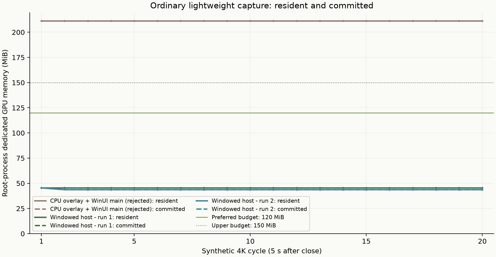
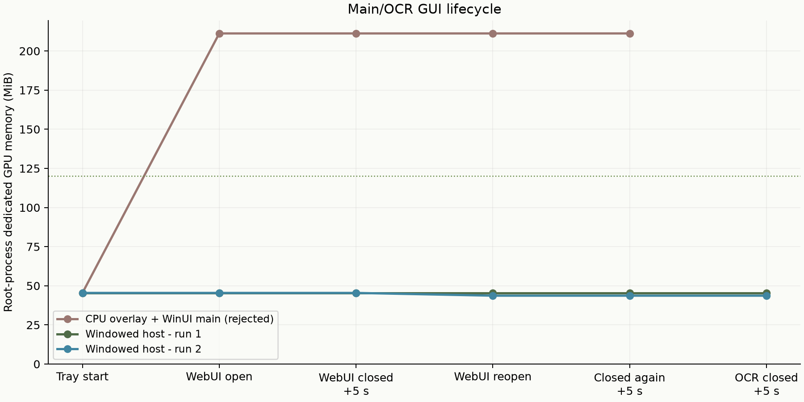

# 轻量模式 CPU 改造与显存验证

日期：2026-10-08（Asia/Shanghai）。版本：本地隔离 `2.6.0-preview.5`。
安装目录未修改。按用户要求，没有桌面鼠标/键盘操作、真实桌面截图或 WGC 压力测试。

## 结果

两次独立进程、各 20 轮合成 3840×2160 屏外选区测试中，Starshot 根进程的
GPU 专用常驻与专用已提交均为 **43.66～45.43 MiB**。选区存在、关闭 5 秒后、
主界面重新打开再关闭，以及 OCR 小窗口关闭后，均未出现逐轮专用显存增长。
在这项受控测试中，两项均通过 `<120 MiB` 验收断言。

这证明本轮测量条件下的普通选区/托盘路径满足预算；**不代表已测定屏内选区的
实际峰值，也不代表打开主界面、旧原生图像工具或从 HDR 切回轻量后的所有情形都低于
120 MiB**。没有把可见桌面交互测试伪装成已完成。

| 测试 | 轮数 | 专用常驻 / 已提交范围，MiB | 净增长，MiB | 两项拟合斜率，MiB/轮 | 结果 |
| --- | ---: | ---: | ---: | ---: | --- |
| CPU 选区 + WinUI 主承载层，保留的失败对照，PID 2328 | 20 | 211.2188 / 211.2188 | 0 | 0 | 预算失败 |
| 原生窗口承载层，运行 1，PID 24568 | 20 | 45.4297 / 45.4297 | 0 | 0 | 通过 |
| 原生窗口承载层，运行 2，PID 3380 | 20 | 43.6641～45.4297 / 相同 | -1.7656 | -0.02522 | 通过 |

净增长和拟合使用第 1～20 轮关闭后 5 秒的样本。运行 2 的小幅回落出现在第 2 轮，
随后稳定；没有周期性大幅回落或锯齿，也没有此前接近 4K surface 大小的逐轮增长。
这些测试没有创建 WGC，因此不能据此重新定性 WGC 驱动层问题。



## 两个初始嫌疑的处理

1. **原轻量模式仍使用 GPU 选区窗口：审计确认，现已移除该路径。**
   原来 GDI 抓图后仍上传整张桌面，再交给 WinUI/Win2D 选区。现在普通轻量采集、
   选区、标注、裁切、保存、复制和 OCR 输入均使用 CPU 字节缓冲及短寿命 GDI 窗口。
   纯轻量路径不会创建 CanvasDevice、CanvasBitmap、CanvasSwapChain 或 WGC context。
2. **旧 WGC context 未 teardown：既有成功切换日志不支持这个判断。**
   本次补强异常清理，保证 latest bitmap 释放异常仍执行 session/pool/item 清理，
   多个 context 均尝试退役；清理失败阻止模式提交。没有改变标准/HDR 的长寿命
   WGC 模型、后台复制暂停策略、像素格式或 HDR 数学。此次没有重新运行真实 WGC
   或 HDR→轻量切换的显存实验。

只替换选区还不够：一个中间版本在主 HWND 已销毁、托管主窗口已回收、WebView2
子进程已退出后，根进程仍保留 211.22 MiB。其他运行曾为约 88 MiB，故没有用较低
的一次宣称稳定达标。最终主界面和独立 OCR 小窗口改为原生 HWND 直接承载 windowed
WebView2 controller，保留现有 React UI、消息桥、主题和功能。新主窗口没有全窗
XAML composition 场景；这与低占用结果一致，但没有用它证明具体 Windows/驱动缺陷。

## GUI 生命周期和子进程

| 阶段 | 运行 1 两项专用显存，MiB | 运行 2 两项专用显存，MiB |
| --- | ---: | ---: |
| 托盘隐藏启动 | 45.4297 | 45.4297 |
| 主 WebUI 加载、三个真实编码器生成的合成 4K 图片解码缩略图 | 45.4297 | 45.4297 |
| 主 WebUI 关闭后 5 秒 | 45.4297 | 45.4297 |
| 第 20 轮选区关闭后 5 秒 | 45.4297 | 43.6641 |
| 主界面重新打开再关闭后 5 秒 | 45.4297 | 43.6641 |
| 独立 OCR WebUI 创建、关闭后 5 秒 | 45.4297 | 43.6641 |



每次 GUI 关闭后均断言 HWND 已销毁、所有该测试进程的子进程均退出；两次运行均通过。
自然分配压力后的日志还记录原托管主窗口不再存活，未调用显式 GC。
Toast 静态引用、计时器/队列、bridge 事件和 controller
都解除绑定；初始化失败关闭部分 controller，F5 可重新初始化。窗口销毁失败保留
回调所有权，并允许创建线程重试，不把仍有效的 HWND 标成已释放。

**主界面打开期间 GPU 子进程确实存在。** 运行 1 初次打开时，WebView2 GPU 子进程
常驻/已提交约 258.65 MiB，加载缩略图后约 262.16 MiB；不能把根进程的 45 MiB
说成此时整套软件只有 45 MiB。非 GPU 子进程没有 KMT 统计时 CSV 留空，不伪装成零。
关闭后的进程树为空，因此该测量阶段不存在把占用藏到存活子进程中的情况。

轻量隐藏界面在请求、翻译和设置允许时保存不超过 4 MB 的白名单 workspace 到 RAM，
然后关闭 controller/HWND。重新打开恢复排版草稿；API Key 不进入快照、不写快照到磁盘。
未提交设置、进行中的翻译或工具窗口会延迟关闭以保留用户工作，期间应另计 GUI 占用。

## 功能和构建检查

| 检查 | 结果与边界 |
| --- | --- |
| CPU 栅格、12 种工具、选区/八个拖拽点、失败交接、旧 timer、重复 Dispose | 65 项通过；包括错误线程 DestroyWindow 失败后在创建线程重试；无真实桌面图像 |
| WebUI 消息桥、翻译格式、隐藏 workspace/凭据排除 | 10 项通过 |
| 实际应用进程屏外集成 | 两次各 111 项通过；每次 20 轮；关闭 5 秒后测量；GDI 15→15、USER 46→44，未积累 |
| 新主/OCR GUI 在 200% DPI 的 controller 边界 | 主客户区 2334×1449、OCR 1414×1049；controller 尺寸逐一一致；不是屏内视觉验收 |
| PNG/AVIF/JXL CPU 编码 | 实际字节编码器生成临时文件；PNG 尺寸、RGBA 像素及 alpha 验证，AVIF/JXL 容器签名验证；不声称 AVIF/JXL 已做逐像素画质比较 |
| PNG/AVIF/JXL 4K 图库缩略图 | 显式走实际解码函数，输出 720×405 PNG；避免屏外浏览器跳过 lazy load 而漏测 |
| self-contained Release build / trimmed publish | 成功；原有失效本地 NuGet 源及第三方 trim 警告仍存在 |
| 原样 trimmed 发布程序托盘隐藏启动 | 成功，约 2/7/17 秒采样均 45.4297 MiB 两项；没有改 runtime、插入 hook 或替换入口程序集；此检查只证明启动并持续运行，不证明发布版 GUI/截图交互已实测 |
| 自定义 libultrahdr | Build/publish 均保留已验证 1,541,632-byte DLL；SHA-256 `415EE12ED6E979D1A96A495AFCB634D54FBACF69E5B9E45C95C38793C737384B` |

集成测试仅在独立临时副本启用 .NET startup hook；生产版默认不启用。测试进程内停止
原有周期 GC 计时器，没有新增或调用 GC.Collect；生产原计时器未修改。

## 代价和未覆盖范围

- CPU 4K 缓冲、预览及裁切带来系统内存分配压力。关闭后 private memory 在 20 轮中
  约从 475～478 MiB 上升到 675～677 MiB，后段趋于平台。此任务没有把它当成专用显存，
  也没有声称 CPU 私有内存已经优化完成；仅凭这些进程计数不能证明或排除托管对象泄漏。
- 贴图、GIF、长截图仍在用户明确选择这些工具时上传选区图像到原生 GPU 工具；
  OCR 编辑器使用 WebView2。旧原生工具/设置弹窗仍可启动 WinUI 场景，打开或关闭这些
  工具后的整套应用预算未在本轮认证。
- GDI 轻量截图输出 SDR，具有桌面 GDI 捕获的受保护内容限制。
- 未操作鼠标键盘、未生成真实桌面截图，未重新实测 HDR 切换、可见选区峰值、
  视觉样式、滚动录制、剪贴板/OCR识别和完整实际保存交互；保持用户给定验证范围。

## 文件和复现

实现主要位于 `src/Starshot/Features/Screenshot/CpuCapture*.cs`、
`CpuRegionCaptureWindow.cs`、`ScreenCaptureService.Lightweight.cs`，主承载层为
`src/Starshot/Features/ViewHost/MainWindow.cs`。原 MainWindow.xaml/.xaml.cs 已移除。
应用主引用、toast、WebUI bridge/workspace 和必要的异常释放也已对应更新。
设计依据见 [ADR-0001](../adr/0001-lightweight-cpu-capture.md)。

原始数据：

- [失败的 WinUI 对照 CSV](lightweight-validation-final-20261008/starshot-synthetic-4k.csv)
- [运行 1 CSV](lightweight-validation-native-host-run1-20261008/starshot-synthetic-4k.csv)、[子进程 CSV](lightweight-validation-native-host-run1-20261008/webview2-process-tree.csv)
- [运行 2 CSV](lightweight-validation-native-host-run2-20261008/starshot-synthetic-4k.csv)、[子进程 CSV](lightweight-validation-native-host-run2-20261008/webview2-process-tree.csv)
- [发布程序启动 CSV](lightweight-validation-published-native-host-20261008/published-hidden-startup.csv)
- [拟合与阶段汇总 JSON](lightweight-cpu-curves-20261008/summary.json)

```powershell
./tools/Validate-LightweightOffscreen.ps1 -BuiltApp ./build/lightweight-cpu-build `
  -ReportDirectory ./docs/reports/your-new-run -LibraryFixtures

./tools/Validate-LightweightOffscreen.ps1 -BuiltApp ./build/lightweight-cpu-publish/app `
  -ReportDirectory ./docs/reports/your-new-published-smoke -PublishedSmoke
```

测试只在独立 temp 目录创建合成编码样本、应用副本及缓存，finally 清理成功；不保留
样本图，只保留日志、CSV 和曲线。纯显存轮次不落盘图像。安装目录没有改动。

三个更早诊断留下的 `lightweight-validation-20261003/webview2`、
`lightweight-validation-tree-release-20261003/webview2`、
`lightweight-validation-software-web-20261003/webview2` 缓存清理被自动审批拒绝，
返回原因仅为 `blocked by policy`，因此旧缓存仍存在。本轮两个集成测试及发布启动
测试的独立临时目录均已在各自 finally 中清理成功。
