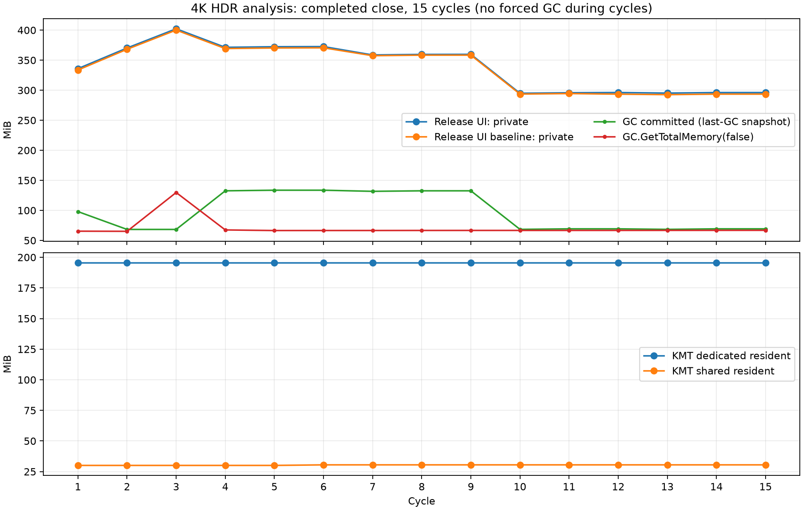

# HDR 亮度分析仪：生命周期与 GPU Readback 专项验证

结论：在这次独立 Release 合成输入测试中，没有发现每轮残留一份大型分析缓存的真实引用泄漏。Private Memory 的上涨主要伴随 LOH 分配、延迟回收和 CLR 已提交堆保留；宿主初始化与原生图形资源也影响总数。没有为了压低数字而改动生产算法、读取架构或调用强制 GC。短期结果不证明长期零增长。

## 测试条件与完整数据

Windows 10.0.26220.0，.NET 10.0.12，16 个逻辑处理器，Workstation GC。应用与 UI 宿主均为 Release；每次独立进程。使用 3840×2160 合成 FP16 scRGB 灰阶纹理，隐藏 XAML HWND、200% 坐标映射；没有桌面捕获、鼠标键盘操作、剪贴板或图片落盘。4K 亮度缓存 31.6406 MiB、P99 副本 31.6406 MiB，条带 1,044,480 bytes（34 行，0.996 MiB），每轮 64 次读取。默认不启用波形与热力图。

完整逐次开启/关闭数据及全部 34 列见 [最终 Release CSV](ui-diagnostic/lifecycle-memory.csv)；另一个独立进程的 [基线 CSV](ui-baseline/lifecycle-memory.csv)；无 Win2D 的 [CPU 隔离 CSV](cpu/lifecycle.csv)。性能事件、GC 事件、取消测试与原始运行日志保留在对应目录。

数值单位 MiB，表中“开 / 关”两项均在该动作及任务收尾完成后采样。每轮关闭时 owned cache/CTS/heatmap 字段均为空、pending 已完成、活跃分析/绘制操作与运行中 Task 均为 0。采样 KMT 时自身会同步阻塞，因此测量阶段单独标记为 memory_sampling，不计作分析读取时间。

| 轮次 | Private 开 / 关 | WorkingSet 开 / 关 | 托管估计 开 / 关 | 关闭时弱引用：亮度/排序/条带 |
|---:|---:|---:|---:|---|
| 1 | 335.93 / 335.93 | 317.03 / 317.25 | 65.35 / 65.39 | 1/1/1 |
| 2 | 370.30 / 370.30 | 351.84 / 351.91 | 65.14 / 65.17 | 1/1/1 |
| 3 | 402.27 / 402.27 | 384.04 / 384.03 | 129.76 / 129.78 | 2/2/2 |
| 4 | 371.43 / 371.43 | 354.38 / 354.36 | 67.44 / 67.47 | 1/1/3 |
| 5 | 372.43 / 372.43 | 355.57 / 355.55 | 66.42 / 66.45 | 1/1/2 |
| 6 | 372.66 / 372.66 | 355.86 / 355.84 | 66.45 / 66.49 | 1/1/2 |
| 7 | 358.75 / 358.75 | 342.06 / 342.03 | 66.49 / 66.52 | 1/1/2 |
| 8 | 359.64 / 359.64 | 343.01 / 342.98 | 66.56 / 66.61 | 1/1/2 |
| 9 | 359.68 / 359.75 | 343.26 / 343.31 | 66.58 / 66.65 | 1/1/2 |
| 10 | 294.96 / 294.96 | 279.14 / 279.12 | 66.60 / 66.66 | 1/1/2 |
| 11 | 295.84 / 295.85 | 280.13 / 280.11 | 66.61 / 66.67 | 1/1/2 |
| 12 | 296.21 / 296.21 | 280.18 / 280.14 | 66.64 / 66.69 | 1/1/2 |
| 13 | 295.29 / 295.28 | 279.34 / 279.30 | 66.69 / 66.74 | 1/1/2 |
| 14 | 296.15 / 296.15 | 280.21 / 280.19 | 66.72 / 66.78 | 1/1/2 |
| 15 | 296.16 / 296.15 | 280.22 / 280.19 | 66.78 / 66.84 | 1/1/2 |

以下是关闭时的最近一次 GC 快照，**不是实时存活堆大小**。GC.GetTotalMemory(false) 也是未强制收集的托管内存估计，包含尚未回收的不可达对象。GenerationInfo[3] 是 LOH 的 GC 前/后快照，LOH 大小包含空洞；完整 CSV 同时记录 LOH before/after、GC Index、GC Generation。

| 轮次 | GC Index / Gen2 次数 | Heap 快照 | Committed 快照 | Fragmented 快照 | LOH after / 空洞 | Dedicated / Shared 驻留 |
|---:|---:|---:|---:|---:|---:|---:|
| 1 | 1 / 1 | 34.61 | 98.01 | 1.19 | 32.64 / 0.00 | 195.41 / 30.05 |
| 2 | 3 / 3 | 34.41 | 68.31 | 1.01 | 33.63 / 1.00 | 195.41 / 30.05 |
| 3 | 3 / 3 | 34.41 | 68.31 | 1.01 | 33.63 / 1.00 | 195.41 / 30.05 |
| 4 | 4 / 4 | 35.94 | 132.59 | 0.40 | 34.63 / 0.00 | 195.41 / 30.05 |
| 5 | 5 / 5 | 37.18 | 133.59 | 2.65 | 35.63 / 1.99 | 195.41 / 30.05 |
| 6 | 6 / 6 | 37.38 | 133.59 | 2.80 | 35.63 / 1.99 | 195.42 / 30.51 |
| 7 | 7 / 7 | 35.42 | 131.72 | 0.83 | 33.63 / 0.00 | 195.42 / 30.51 |
| 8 | 8 / 8 | 36.56 | 132.59 | 1.94 | 34.63 / 1.00 | 195.42 / 30.51 |
| 9 | 9 / 9 | 36.83 | 132.59 | 2.13 | 34.63 / 1.00 | 195.42 / 30.51 |
| 10 | 10 / 10 | 35.84 | 68.43 | 1.12 | 33.63 / 0.00 | 195.42 / 30.51 |
| 11 | 11 / 11 | 36.84 | 69.30 | 2.12 | 34.63 / 1.00 | 195.42 / 30.51 |
| 12 | 12 / 12 | 36.86 | 69.30 | 2.10 | 34.63 / 1.00 | 195.42 / 30.51 |
| 13 | 13 / 13 | 35.87 | 68.43 | 1.08 | 33.63 / 0.00 | 195.42 / 30.51 |
| 14 | 14 / 14 | 37.05 | 69.30 | 2.23 | 34.63 / 1.00 | 195.42 / 30.51 |
| 15 | 15 / 15 | 37.12 | 69.30 | 2.26 | 34.63 / 1.00 | 195.42 / 30.51 |

最终运行第 10–15 轮 Private 拟合斜率 0.169 MiB/轮。基线运行也出现中途回落，未保持最初约 64 MiB/轮的增长。不能把这段短期趋稳解释为长期保证。开启第 1 轮至关闭第 15 轮，Dedicated 净变化 -0.1172 MiB，Shared +0.4609 MiB；两种 GPU 计数不是进程 Private Memory。

## 对象可达性与 GC 前后

诊断只保存 WeakReference，不持有数组、模型、UI 面板或任务；周期辅助方法禁止内联，统计 WeakReference 时不跨 GC 保留 Target。正常关闭先清空字段，等待 _analysisPending 与波形/热力图任务全部结束。第一次 UI 基线进程的诊断 GC 紧接 15 轮；最终进程另外完成取消/异常等场景后才执行唯一一次 Collect → WaitForPendingFinalizers → Collect 序列。此序列只存在测试程序。

| 最终进程阶段 | Private | 托管估计 | Heap 快照 | Committed 快照 | LOH after / 空洞 | 亮度/排序/条带弱存活 | Dedicated / Shared |
|---|---:|---:|---:|---:|---:|---|---:|
| after_15_cycles | 296.16 | 66.88 | 37.12 | 69.30 | 34.63 / 1.00 | 1/1/2 | 195.42 / 30.51 |
| before_forced_gc | 407.95 | 36.61 | 42.01 | 139.03 | 40.13 / 5.37 | 1/0/3 | 543.88 / 40.58 |
| after_forced_gc | 400.89 | 1.67 | 1.87 | 131.86 | 0.38 / 0.25 | 0/0/0 | 543.88 / 40.58 |
| after_source_dispose | 398.14 | 1.85 | 1.87 | 131.86 | 0.38 / 0.25 | 0/0/0 | 262.77 / 7.48 |

诊断 GC 后，亮度、排序、条带、model、CTS、panel、Task、waveform density/pixels/bitmap、heatmap pixels/texture 的弱引用存活全部为 0，见 [弱引用结果](ui-diagnostic/weak-references-after-gc.json)。关闭后 GC 前 WeakReference.IsAlive=1 只表示尚未回收，不能据此断定还有强根。跨多轮自动 GC 后旧数组已消失，最后诊断 GC 清掉剩余对象，因此这次不需要进一步抓取 GC Root 才能解释大型缓存。

纯 CPU 独立进程跟踪 45 个大型缓冲区，GC 前 3 个、GC 后 0 个存活。GC 后托管估计约 0.46 MiB、Heap 快照约 1.55 MiB，但 CLR 仍提交约 129.44 MiB，Private 约 138.88 MiB。这直接证明“数组已回收但提交空间仍保留”可以在完全没有 Win2D/图形驱动的宿主中发生。不能将 Private 的每个字节都归因于 CLR。

最终 UI 进程额外创建了故意提前 Dispose 的故障纹理及热力图等资源，所以最终 GC 的 Private/GPU 绝对值不应与第 15 轮简单相减当作分析泄漏。借用的输入纹理在 15 轮期间有意保持存活；最终 Dispose 后 GPU 明显回落，剩余驻留可能包含共享设备/XAML/驱动保留。本轮没有做原生分配对象归因，不能将所有残余 Private/GPU bytes 逐项解释，也未证明它属于分析缓存泄漏。

宿主无分析的 15 次控制采样也有小幅初始化增长，远小于 31.64/63.28 MiB 缓冲区大小；见 CSV 的 host_start～host_15。大型数组是 LOH 对象，通常随 Gen2 收集，回收后空闲段可继续保持提交并被后续分配复用。[Microsoft LOH 文档](https://learn.microsoft.com/en-us/dotnet/standard/garbage-collection/large-object-heap)；快照定义见 [GCMemoryInfo](https://learn.microsoft.com/en-us/dotnet/api/system.gcmemoryinfo?view=net-10.0)。

## 生命周期检查与异常场景

- 正常关闭：取消并失效 generation，清空亮度/统计、面板 Content、Image.Source、参数控件字段和 metrics 字典，解除外层面板 Pointer/DoubleTapped 订阅。子控件事件随旧 Content 失去根；没有发现外部长期订阅。
- 快速重开：新分析等待前一个 _analysisPending 收尾再分配完整缓存；generation/取消/源纹理身份检查阻止旧结果发布。波形与热力图各自还有独立版本检查。
- P99：排序副本只在 Finish 中是局部变量，不进入结果模型。Task/闭包可在执行中临时持有缓冲，任务完成后诊断 GC 能回收；没有每轮积存一个任务。
- 计算中立即关闭、读取中关闭、排序中关闭、重新选区、会话关闭、读取异常、波形/热力图任务中关闭均通过；异常后状态提示存在，缓存清空，可安全关闭。取消测试均无旧缓存/纹理重新发布。
- 临时 Win2D 热力图在关闭、Off 和替换时 Dispose；原始输入纹理为借用，分析代码不擅自 Dispose。所有大缓冲最终不可达，没有发现遗漏的临时 Win2D 所有权。
- 正常任务完成后 CTS 由当前面板持有，关闭时 Dispose；提前关闭后活动分析 finally 负责 Dispose；不靠 GC.Collect 回收引用。

普通取消到收尾约 10.76–12.86ms（包含测试显式等待的 10ms 调度排空）；排序中取消约 231.16ms。Array.Sort 不能中途取消，后台排序结束后立即检查 token，UI 面板关闭不等待排序，后续重开等待它完成。这是已量化的有限延迟，而不是无法停止的后台任务。

## GPU Readback 与 UI 响应

下表只取完整 15 轮正常分析，不混入故障纹理读取、取消场景和诊断 GC。每条带 Stopwatch 汇总，没有每条带即时写日志。后台 CPU 与 UI Dispatcher 测量分别记录。

| 项目 | 次数 | P50 ms | P95 ms | P99 ms | 最大 ms | 累计 ms |
|---|---:|---:|---:|---:|---:|---:|
| readback | 960 | 0.314 | 0.706 | 6.704 | 7.947 | 499.56 |
| append_cpu | 960 | 1.073 | 1.541 | 1.825 | 7.202 | 1049.06 |
| p99_clone | 15 | 6.099 | 8.301 | 8.301 | 8.301 | 95.39 |
| p99_sort | 15 | 197.650 | 434.124 | 434.124 | 434.124 | 3199.08 |
| statistics_cpu | 15 | 223.499 | 456.787 | 456.787 | 456.787 | 3543.10 |
| analysis_total | 15 | 417.699 | 695.471 | 695.471 | 695.471 | 6619.93 |
| dispatcher_normal_same_phase | 1239 | 0.099 | 5.085 | 15.572 | 41.057 | 1079.57 |

每轮累计耗时（并行/调度阶段不可简单相加成总耗时）：

| 轮次 | 条带读取合计 ms | 后台亮度 ms | P99 排序 ms | 完整分析 ms |
|---:|---:|---:|---:|---:|
| 1 | 29.11 | 77.76 | 434.12 | 695.47 |
| 2 | 37.76 | 79.59 | 191.28 | 459.36 |
| 3 | 52.53 | 71.82 | 193.18 | 417.70 |
| 4 | 49.82 | 91.76 | 193.29 | 439.76 |
| 5 | 47.48 | 65.12 | 203.73 | 443.02 |
| 6 | 69.67 | 68.73 | 194.26 | 495.42 |
| 7 | 43.90 | 73.39 | 197.65 | 440.74 |
| 8 | 21.70 | 66.58 | 175.19 | 394.11 |
| 9 | 20.88 | 67.25 | 203.20 | 409.95 |
| 10 | 19.68 | 65.87 | 204.78 | 411.63 |
| 11 | 27.54 | 67.21 | 201.93 | 428.24 |
| 12 | 21.97 | 61.34 | 194.64 | 393.44 |
| 13 | 20.21 | 65.51 | 200.23 | 393.53 |
| 14 | 18.84 | 64.54 | 194.33 | 381.79 |
| 15 | 18.49 | 62.60 | 217.28 | 415.76 |

条带之间确实 await 后台转换和至少 1ms Delay。5ms UI 心跳及独立后台发起的 Dispatcher 探针在分析期间持续运行，最终正常分析没有持续占满 Dispatcher 的证据；这不意味着没有短时抖动。

最终正常分析 UI 心跳间隔 P95=7.04ms、P99=17.12ms、最大=46.41ms。同阶段 Normal Dispatcher 探针最大=41.06ms。热力图 CPU 14.18ms（后台），上传 2.39ms（UI）；波形 CPU 46.11ms（后台）。此测试没有真实上屏 Present/输入延迟测量。

另一个独立基线进程出现一次正常 readback 167.45ms 尖峰（P99 0.659ms），对应约 190ms 心跳间隔，属于可感知的短时停顿，不能忽略。该进程没有 GC 事件关联，不能归因于 GPU 驱动或 CLR。增加 GC 事件跟踪后的 15 轮没有复现该尖峰；正常最大 7.95ms。故障测试中约 90.47ms 是读取已 Dispose 纹理的异常路径，单独保留，不冒充正常 readback P99。

基线 optional_views 的 Dispatcher 探针曾出现约 940ms 延迟，但 UI 心跳最大约 66ms；这不等价于 UI 连续阻塞 940ms，存在排队/测试初始化扰动。补测区分 fixture_setup、memory_sampling、readback_exception，并保存发起/回调阶段和时间；最终 optional_views 探针最大约 28.27ms。不能用两次短运行排除偶发驱动等待。GC 事件原始时间及 Reason/Type 保存在 gc-events.json，readback 另记 Gen2 计数前后；计数未变化也不能完全排除已经进行中的 GC。

综合判断：存在一次未归因的 readback 长尖峰，需要诚实保留；没有确认当前条带架构持续导致严重 UI 卡顿，因此没有盲目换线程或改变条带大小。如果真实使用中复现相同尖峰，下一步使用一次包含 .NET GC 与 CPU/UI 线程等待栈的 ETW 跟踪，将 native GetPixelBytes 等待与 CLR 暂停放到同一时间线上。

## 实际改动与前后比较

本次没有修改分析算法或资源释放行为，只增加默认关闭的诊断钩子和隔离测试。正常应用 Listener 为空，不分配计时/弱引用对象。没有 ArrayPool、常驻缓存、强制 GC、WGC、HDR 编码、OCR 或其他截图资源管理改动。

| 文件 | 本次用途与必要性 |
|---|---|
| src/Starshot/Features/Screenshot/HdrAnalysisDiagnostics.cs | 内部可选 observer；WeakReference、分阶段计时、活跃操作跟踪；正常运行关闭。 |
| src/Starshot/Features/Screenshot/HdrLuminanceAnalysis.cs | 亮度缓存/排序/波形/热力图弱引用与后台 CPU 分阶段计时；数学逻辑不变。 |
| src/Starshot/Features/Screenshot/RegionCaptureWindow.HdrAnalysis.cs | 读取、完整任务、热力图上传计时，CTS/Task/面板/纹理弱引用和关闭标记；同一线程与生命周期不变。 |
| tools/HdrLuminanceTest/Program.cs、HdrLuminanceTest.csproj | 15 轮 CPU 控制实验，独立验证 CLR 堆保留，不依赖 GPU。 |
| tools/RegionToolbarUiTest/ToolbarTestApp.HdrDiagnostics.cs、HdrGcEventListener.cs、Program.cs | 真正 Release 隐藏 XAML 诊断分支、完整指标、弱引用、GC 事件、取消/异常/关闭测试。 |
| tools/RegionToolbarUiTest/Run.ps1 | 宿主随应用使用同一 Debug/Release 配置；修正 Debug 测试完成后原 20s 等待预算不足的误超时，独立进程最长 60s。 |
| tools/RegionToolbarUiTest/Summarize-HdrDiagnostics.py、docs/reports/hdr-analysis-lifecycle-20261009/ | 可复查的统计、完整原始数据与曲线；绘图依赖仅在 build/，不进入发布依赖。 |

之前 5 轮中位 460ms，本次两个 15 轮正常分析中位分别 413.49 / 417.70ms。算法未改、并非严格优化前后 A/B，不能将差异宣称为性能提升。内存改进也不存在：本次证明旧对象可回收，并把“关闭引用”“GC 回收”“提交空间归还”分开测量。

## 回归与限制

- 数学测试 32 项；CPU/GDI 交互/资源测试 108 项；共享布局 1,210,101 项（126 DPI/显示器组合）通过。
- 15 轮 Release 生命周期诊断与取消/异常/选区/会话/可选叠层验证 43 项通过。
- 应用 Debug / Release 构建通过；真实 XAML 回归 Debug 59 / Release 59 项通过，进程均正常退出，见 regression-debug / regression-release。测试宿主首次构建保留 WindowsAppSDK 自动初始化类型冲突的两个 CS0436 警告，应用本身构建 0 警告、0 错误。
- Debug 首次回归功能断言全部通过，但测试进程在原 20s 退出预算下误报超时；增至 60s 后重新验证最终结果。
- 原始 FP16 计算、统计/P99、波形、热力图、8K 抽样、HDR 资格、SDR/轻量禁用行为保持原样；热力图前后原始 FP16 与 SDR 保存 crop 逐字节一致的现有 UI 回归保留。
- 尚未验证长时间真实桌面会话、真实 8K GPU readback、其他显卡/驱动、真实多屏内容或高 GPU 负载下交互延迟；合成测试不证明这些环境都没有抖动。没有覆盖安装版、推送 GitHub 或发布 Release。
